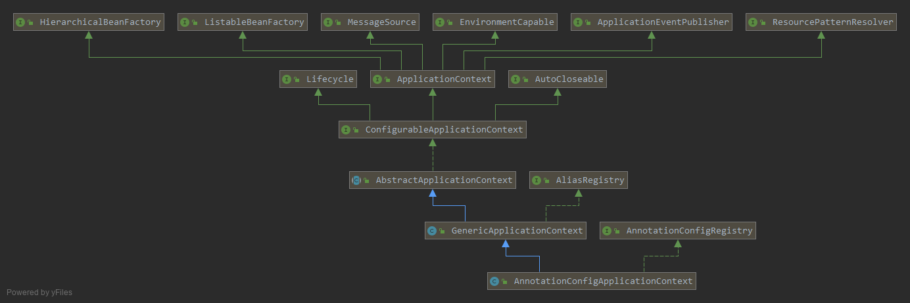
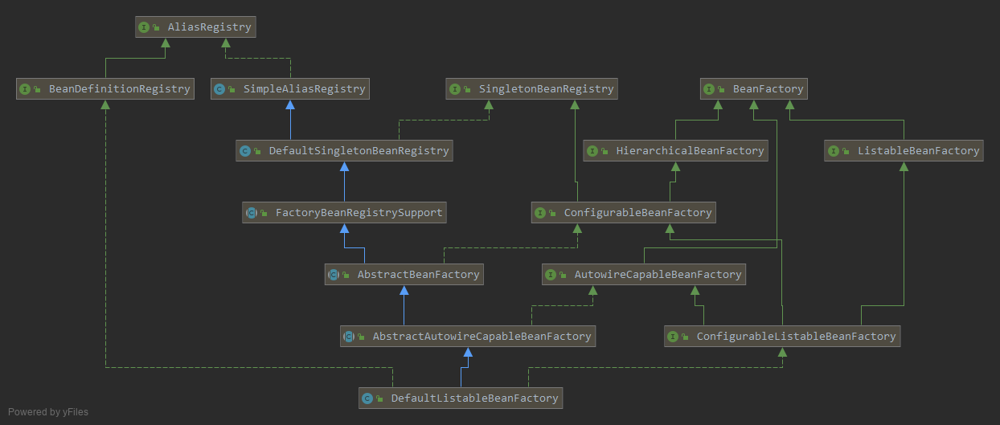
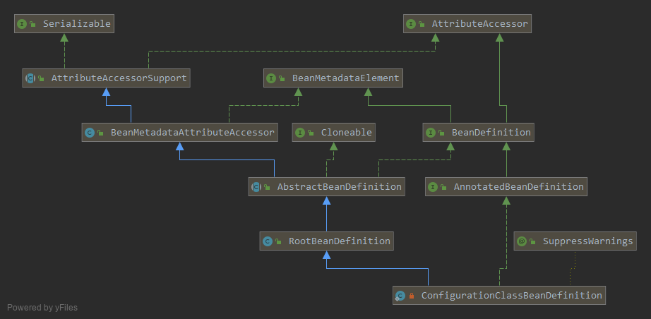
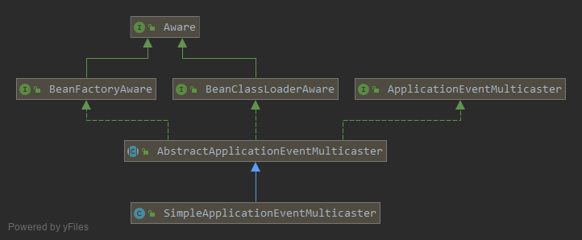

### spring 梳理-01-重要接口


#### 1.`ApplicationContext`



```java
// 为应用提供配置的核心接口，EnvironmentCapable, ListableBeanFactory, //HierarchicalBeanFactory,MessageSource, ApplicationEventPublisher, ResourcePatternResolver
ApplicationContext 
    // 提供修改配置方法
    ConfigurableApplicationContext 
    // 提供以上大部分接口的实现
    	AbstractApplicationContext  
    		// 通用的ApplicationContext,持有一个DefaultListableBeanFactory
    		GenericApplicationContext
    			// 支持注解配置的spring容器
    			//AnnotatedBeanDefinitionReader 注册被标注注解的类，如@Configuration
    			//ClassPathBeanDefinitionScanner 注解类路径下候选的类，如								//@Component,@Controller,@Service,@Repository
    			AnnotationConfigApplicationContext
```

- `EnvironmentCapable`,赋予容器获得环境变量的能力。由`AbstractApplicationContext`中通过`StandardEnvironment`提供实现。
- `ListableBeanFactory`,赋予容器枚举的能力。由`GenericApplicationContext`中通过`DefaultListableBeanFactory`提供实现。
- `HierarchicalBeanFactory`。容器分层   `DefaultListableBeanFactory`
- `MessageSource`，国际化。`AbstractApplicationContext`中，容器刷新，实例化`DelegatingMessageSource`
- `ApplicationEventPublisher`，发布事件。`AbstractApplicationContext`中`SimpleApplicationEventMulticaster`，将事件发给所有的监听器
- `ResourcePatternResolver`,资源解析。`AbstractApplicationContext`中`PathMatchingResourcePatternResolver`

> 综上：
>
> - `AbstractApplicationContext`作为容器启动初始化的模板，固定了容器启动的算法，实现了大部分扩展的接口。提供了资源解析、国际化、发布时间、获取环境变量
> - 具体的底层容器，通过`GenericApplicationContext`中默认使用的`DefaultListableBeanFactory`作为实现。
> - 而`DefaultListableBeanFactory`使用`map`作为容器，存储`beanName`和`beanDefinition`

#### 2.`BeanFactory`



```java
BeanFactory // 访问spring容器的最底层的接口
    HierarchicalBeanFactory //带有分层能力的beanFactory
    	ConfigurableBeanFactory // 可配置的beanFactory
    		AbstractBeanFactory// 抽象beanFactory，提供以上接口的大部分实现
    			AbstractAutowireCapableBeanFactory // 可自动装配
    				DefaultListableBeanfactory  // 默认实现，新增可枚举
```


#### 3.`BeanDefinition`



```java
BeanDefinition //描述bean实例，eg. parentName,scope,lizyInit,dependsOn...
    AbstractBeanDefinition //具体beanDefiniton的基类，定义了具体bean定义的共同属性和默认值
    	RootBeanDefinition //新增了运行时的bean定义
    		ConfigurationClassBeanDefinition //新增注解配置的bean定义
```

#### 4.`ApplicationEventMulticaster`



```java
ApplicationEventMulticaster // 管理监听器，并发布事件给监听器
```

#### 5.`Aware`

> 该接口是一个标记接口，通过回调的方式，使得实现了该接口的对象可以获得容器的底层对象

#### 6.`ApplicationEvent`

```java
ApplicationEvent
	ApplicationContextEvent
    	ContextStartEvent
    	ContextRefreshEvent
    	ContextStopedEvent
    	ContextClosedEvent
```

#### 7.`BeanPostProcessor`

> 拦截bean的初始化过程

#### 8.`ioc`容器的标准初始化

> `prepareBeanFactory(beanFactory);`
>
> 在bean工厂的预处理之后

#### 9.`BeanFactoryPostProcessor`

- bean工厂的后置处理器，在容器的标准初始化之后生效，允许对bean工厂进行配置。
- 使用`ConfigurableListableBeanFactory`